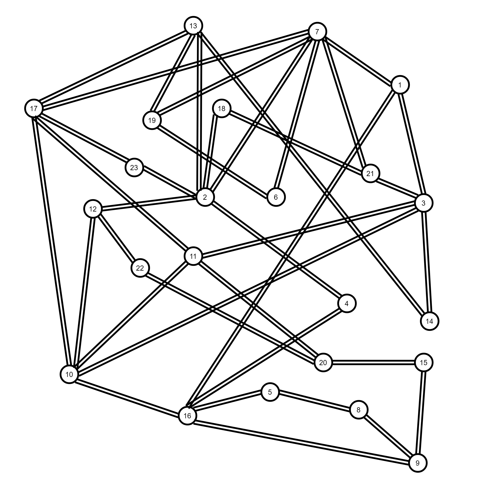

# Evaluating RNN Models for Multi-Step Traffic Matrix Prediction
The model with entire details will be uploaded soon


# GÉANT Backbone Network Data

The GÉANT Backbone Network dataset is the most well-known Traffic Matrix dataset. You can download the raw data [here](https://totem.info.ucl.ac.be/dataset.html).

GÉANT Backbone Network topology consists of 23 nodes and 38 links, as described below:

<div align="center">
  
</div>

The dataset contains Traffic Matrices from 4 months of capturing with a 15-minute interval. Originally, each traffic matrix is stored in a single XML file. For more convenience in using the dataset, we use the same method of [Duc-Huy Le](10.1109/ICC42927.2021.9500331) to convert all of the separate matrices into a single file. geant-dataset.csv is the final converted dataset. The dataset consists of 10772 traffic matrices.


#### Machine Learning packages

> In our project, we use [keras](https://keras.io/) and tensorflow framework to train our models, in addition, we also use several packages such as pandas, numpy, sklearn to preprocess data for training and matplotlib for result visualization. All ML source codes are written in jupyter-notebook. The packages can be installed by pip as follows:

```
python -m pip install -U pip
python -m pip install tensorflow, keras, numpy, pandas, scikit-learn, matplotlib, jupyter-notebook
```

> https://www.tensorflow.org/install/pip

### Traffic Matrix Prediction
Machine Learning models
In our project, to deal with the multiple-time series prediction problem, we compared six popular RNN variants: Long Short-Term Memory (LSTM), Bidirectional LSTM (BiLSTM), Gated Recurrent Unit (GRU), and Bidirectional GRU (BiGRU), Stack LSTM (SLSTM), and Stack GRU (SGRU). The layers are well-described in our paper. They are all trained through 10 epochs and the best parameter set is mentioned in detail in the paper.

### Data Preparation
Firstly, to normalize the data, we divide all of the traffic volume by the biggest one so that every value is in the range (0, 1). From the raw matrices, we form a time series dataset by grouping 15 consecutive matrices as a record (10 first matrices are the input and the last five are the output of the record). Secondly, we divide the dataset into two subsets: 80% used for training and 20% used for evaluation.

### Methodology
In this work, we assume that each Original-Destinaion (OD) traffic is independent of other ones. So that we feed the models with one OD traffic at a time.

The training processes are operated using TensorFlow and Keras framework.

Please, if you find the code useful, cite our work.

@article{nsaif2024sm,
  title={SM-FPLF: Link-State Prediction For Software-Defined DCN Power Optimization},
  author={Nsaif, Mohammed and Kov{\'a}sznai, Gergely and Malik, Ali and De Fr{\'e}in, Ruair{\'\i}},
  journal={IEEE Access},
  year={2024},
  publisher={IEEE}
}

